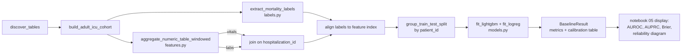

# feat: Phase 4 LightGBM baseline for in-hospital mortality

**Goal:** Cross the line from Phase 3 (descriptive features) to Phase 4 (predictive baseline)
per `docs/roadmap.md`. Produce a reproducible LightGBM model that predicts in-hospital mortality
from first-24h vitals and labs, with no patient leakage between train and test, a logistic
regression sanity comparator, and a calibration check. Wrap the pipeline in
`notebooks/05_baseline.py` so the result is reviewable and re-runnable.

This is a **baseline benchmark**, not a publication-track analysis. The work uses sensible
defaults (no hyperparameter tuning, no subgroup analysis, no decision curves) and is the
foundation on which a future SAP-tracked study would build.

---

## Problem Frame

The library has all the *ingredients* for prediction work:
- `cohorts.build_adult_icu_cohort` produces a patient/hospitalization-level cohort
- `features.aggregate_numeric_table` produces per-hospitalization vitals/labs aggregates
- 4 marimo notebooks demonstrate the inspect → QC → cohort → features flow

What is missing for a baseline:
1. **No outcome label.** Mortality is not extracted from the hospitalization table anywhere.
2. **No time anchor or observation window.** `aggregate_numeric_table` aggregates *all*
   measurements for a hospitalization — including ones after death. This is silent leakage.
3. **No patient-aware split.** Random row splits would put the same patient in train and test
   (CLAUDE.md §8 explicitly forbids this).
4. **No model wrapper.** No place to fit, evaluate, persist a model with a seed.
5. **No calibration check.** LightGBM is well-known to produce uncalibrated probabilities;
   without an explicit check, downstream "risk thresholds" are meaningless.
6. **`docs/data_dictionary_notes.md` was never created.** CLAUDE.md build-order step #3 was
   skipped during the notebook work. Without it, the next contributor has to re-discover what
   `discharge_category`, `admission_dttm`, etc. actually look like in CLIF-MIMIC.

The plan addresses each of these in order. The notebook drives the pipeline end-to-end so the
result is concrete (a number with a calibration curve), not abstract.

---

## Requirements Trace

| Requirement | Source |
|---|---|
| LightGBM baseline with leakage checks | `docs/roadmap.md` Phase 4 exit criteria |
| Train/test split must not put same patient in both | CLAUDE.md §8 "No silent patient leakage" |
| Time anchor + observation window must be explicit in code and docs | CLAUDE.md §8 |
| Tolerant of CLIF-MIMIC column-name variants | CLAUDE.md §1 (acknowledge ambiguity) + existing AGE/ICU candidate pattern |
| Reproducible (random seeds, version-pinned) | CLAUDE.md §10, `uv.lock` already exists |
| Fail loudly on missing required columns | CLAUDE.md §7 |
| `docs/data_dictionary_notes.md` documents observed schema | CLAUDE.md build order #3 |
| Calibration check, not just discrimination | Standard ML hygiene; LightGBM outputs uncalibrated probs |
| Notebooks demonstrate, src/ holds tested code | CLAUDE.md coding standards |
| No GPU / foundation-model work | User constraint; roadmap Phase 5 (deferred) |

---

## Scope

### In scope
- `docs/data_dictionary_notes.md` documenting actual CLIF-MIMIC column names observed locally
- New module `src/icumodelstream/labels.py` — extract in-hospital mortality from the
  hospitalization table
- Extension to `src/icumodelstream/features.py` — `aggregate_numeric_table_windowed` that
  filters by `[anchor, anchor + window]` before aggregating
- New module `src/icumodelstream/splits.py` — group-aware train/test split by `patient_id`
- New module `src/icumodelstream/models.py` — LightGBM + logistic-regression wrappers with
  fixed seeds and a `BaselineResult` dataclass containing metrics + calibration data
- Notebook `notebooks/05_baseline.py` driving the full pipeline end-to-end
- Unit tests for every new module using hand-built toy parquet fixtures
- `pyproject.toml` ML extras update if needed (already has `lightgbm`, `scikit-learn`, `numpy`,
  `pandas`)

### Deferred to follow-up work
- Hyperparameter tuning (use LightGBM defaults; tune only after baseline is locked)
- SHAP / feature importance plots
- Decision-curve analysis (publication-track)
- Subgroup performance / fairness analysis (TRIPOD+AI rigor)
- External validation (single dataset for now)
- CLI commands for the new modules (`make baseline` etc.)
- Additional outcomes (LOS > 7d, 30-day readmission, ICU mortality vs in-hospital)
- Multi-seed re-runs for variance estimation
- Time-varying covariates / sequence models

### Out of scope
- GPU training scripts (`docs/roadmap.md` Phase 5, deferred until baseline reproducible)
- Foundation-model finetuning (same)
- Any change to `cohorts.py`, `qc.py`, `cli.py`, `io.py`, `schema.py`, `config.py` beyond
  what the modules above genuinely need
- SAP-track design choices (estimand, sensitivity analysis, pre-registration)

---

## Context & Research

**Existing patterns to mirror:**
- `cohorts.py` `AGE_CANDIDATES` + `first_existing_column` — tolerant of CLIF-MIMIC version
  drift. Labels and time-anchor extraction should use the same pattern.
- `features.py` `aggregate_numeric_table` — the windowed version is an extension, not a
  rewrite. Same shape, just adds a `[anchor, anchor + window]` filter step.
- `tests/test_*.py` — `tmp_path` + hand-built polars DataFrames written as parquet, then
  `discover_tables(tmp_path)`. New tests follow this pattern.
- `notebooks/_common.py` — `load_pipeline_config(file, mo)` and
  `discover_pipeline_tables(config, mo)`. Notebook 05 should use these.

**Pinned dependencies (already in `pyproject.toml` ml extras):**
- `lightgbm>=4.3`, `scikit-learn>=1.4`, `numpy>=1.26`, `pandas>=2.2`
- Polars stays the primary DataFrame library. Convert to numpy / pandas only at the
  LightGBM / sklearn boundary.

**CLIF 2.1 expected fields:**
- Hospitalization table: `admission_dttm`, `discharge_dttm`, `discharge_category` (where the
  mortality signal lives; values like `"Expired"`, `"Died"`, `"Hospice"`)
- Vitals / labs: `recorded_dttm` (vitals) and `lab_result_dttm` (labs) provide the timestamp
  to filter against
- Per CLIF spec, all `*_dttm` columns are ISO 8601 UTC

**Reproducibility primitives:**
- `numpy.random.default_rng(seed=42)` and `random_state=42` for sklearn / LightGBM
- `uv.lock` already pins the full dependency tree
- Models persisted to `models/baseline_lightgbm.txt` (LightGBM native format) — `models/`
  already in `.gitignore`

**Calibration:**
- Compute Brier score + reliability diagram (10 bins) at minimum
- Document but do not fix in this baseline — calibration recalibration (Platt scaling, isotonic
  regression) is a follow-up

---

## Key Technical Decisions

| Decision | Choice | Rationale |
|---|---|---|
| Outcome | In-hospital mortality (binary) | Most common ICU outcome; signal is in `discharge_category`; matches CLAUDE.md "boring first" |
| Time anchor | Admission datetime (`admission_dttm` with tolerant candidate fallback) | Standard ICU prediction setup; simpler than ICU-admit-time which requires ADT join |
| Observation window | First 24 hours post-admission | Long enough to capture vitals/labs; short enough to make the prediction nontrivial |
| Prediction horizon | Any time during hospitalization | Mortality flag from `discharge_category` is hospitalization-level, not time-windowed |
| Feature pool | Vitals + labs aggregates from `aggregate_numeric_table_windowed`, joined to cohort | Already implemented; only need the time-window addition |
| Split strategy | GroupKFold by `patient_id`, 80/20 holdout for primary report | Prevents patient leakage (CLAUDE.md §8); GroupKFold also enables future CV without restructure |
| Random seed | `seed=42` across numpy, sklearn, LightGBM | Convention; documented in `models.py` docstring |
| Comparator | Logistic regression with median imputation + standard scaling | Sanity check that LightGBM is doing more than just baseline rate; standard for ML papers |
| Missing data | Pass nulls to LightGBM (native handling); impute for logistic regression | LightGBM handles missing values natively; logistic does not |
| Metrics | AUROC + AUPRC + Brier score + calibration intercept/slope | Discrimination + calibration; AUPRC matters for imbalanced mortality outcome |
| Model persistence | LightGBM native `.txt` format under `models/` | Already gitignored; LightGBM native format is the reproducible default |
| `BaselineResult` shape | Dataclass: model_name, y_true, y_pred_proba, fold_metrics, holdout_metrics, calibration_table | Lets the notebook display everything without reaching into model internals |

---

## Open Questions

None blocking. All deferred items are sequencing decisions, not blockers.

Items that could plausibly be raised later but should not block:
- Should we add LOS > 7d as a second outcome? Defer — pick the second outcome after seeing
  baseline mortality results.
- Should the train/test split be time-based (later admissions = test)? Defer — random by
  patient is fine for a baseline; temporal splits become important for deployment.
- Should features include first-hour-only vs first-24h? Defer — start with 24h, sensitivity
  analysis is a follow-up.

---

## Output Structure

```
src/icumodelstream/
├── labels.py            NEW   In-hospital mortality extraction
├── features.py          MOD   Add aggregate_numeric_table_windowed
├── splits.py            NEW   Group-aware train/test split helpers
└── models.py            NEW   LightGBM + logistic baselines with metrics + calibration

tests/
├── test_labels.py       NEW   Mortality extraction across CLIF variants
├── test_features.py     MOD   Add windowed-aggregation tests
├── test_splits.py       NEW   No patient appears in both splits
└── test_models.py       NEW   Reproducibility, metric shape, calibration shape

notebooks/
└── 05_baseline.py       NEW   End-to-end: cohort → labels → windowed features → split → fit → eval

docs/
└── data_dictionary_notes.md   NEW   Per-table observed column list with CLIF-spec linkage
```

---

## High-Level Technical Design

*Directional guidance for review, not implementation specification. The implementing agent
should treat this as the shape to land in, not code to reproduce.*

Data flow for the baseline notebook:



Key invariants the flow enforces:
- The `[anchor, anchor + 24h]` window in step D is applied BEFORE aggregation, so post-mortality
  measurements cannot influence features
- The split in G is on `patient_id`, not row index, so a patient cannot appear in both folds
- The `BaselineResult` in step I carries the holdout predictions, so the notebook can compute
  any plot from one object

---

## Implementation Units

- U1. **Document the actual CLIF-MIMIC schema**

  **Goal:** Capture the real column names observed in the local CLIF-MIMIC parquet files so
  the next contributor (and the next units of this plan) work from facts, not guesses.

  **Requirements:** CLAUDE.md build order #3.

  **Dependencies:** None. Can run before any code work.

  **Files:**
  - `docs/data_dictionary_notes.md` (new)

  **Approach:** Run `notebooks/01_inspect.py` against the local data root. For each of the 15
  CLIF tables present, record: table name (post-`clif_` strip), row count, column names with
  dtypes, presence/absence of expected CLIF 2.1 fields (`admission_dttm`,
  `discharge_category`, `vital_value`, `lab_value_numeric`, etc.), and any surprises
  (mixed-type columns, unexpected nulls). Cross-link to the CLIF 2.1 official spec at
  `https://clif-icu.com/data-dictionary/data-dictionary-2.1.0` for each table.

  Structure the doc as one H2 section per table with a small column-list table per section.
  Do not paste any patient-level rows — only column names, dtypes, and shape.

  **Test scenarios:** Test expectation: none — this is observed-data documentation, not
  behavior-bearing code.

  **Verification:** A new developer can read `data_dictionary_notes.md` and answer
  "what column holds the discharge disposition?" without opening a parquet file.

---

- U2. **`src/icumodelstream/labels.py` — In-hospital mortality**

  **Goal:** Provide `extract_mortality_labels(tables) -> pl.DataFrame` returning one row per
  hospitalization with columns `hospitalization_id`, `mortality` (1 if expired, 0 otherwise).

  **Requirements:** Phase 4 baseline outcome; CLAUDE.md §1 (acknowledge column ambiguity).

  **Dependencies:** U1 (to know which discharge column actually holds the signal).

  **Files:**
  - `src/icumodelstream/labels.py` (new)
  - `tests/test_labels.py` (new)

  **Approach:** Follow the `AGE_CANDIDATES` + `first_existing_column` pattern from
  `cohorts.py`. Define `DISCHARGE_CATEGORY_CANDIDATES` (e.g., `("discharge_category",
  "discharge_disposition", "discharge_to")`) and `MORTALITY_VALUES` (a frozenset of
  lower-cased values that count as death: `{"expired", "died", "death"}` plus any variant
  observed in U1). If hospice should be included, document the decision in the module
  docstring and make it a parameter (default: hospice = not mortality, conservative for
  a baseline).

  Raise `ValueError` if no discharge column is found, naming the candidates and listing the
  columns that ARE present (CLAUDE.md §7).

  **Patterns to follow:** `cohorts.first_existing_column`,
  `cohorts.build_adult_icu_cohort` for tolerance shape.

  **Test scenarios:**
  - Happy path: 3 hospitalizations with `discharge_category` of `["Expired", "Home", "SNF"]`
    → returns mortality `[1, 0, 0]`
  - Case-insensitive match: `discharge_category` of `["EXPIRED", "expired", "Home"]` →
    returns mortality `[1, 1, 0]`
  - Alternative column name: `discharge_disposition` present instead of `discharge_category`
    → still works
  - Missing required column: hospitalization table has neither candidate → raises
    `ValueError` with a message containing both the candidate list and the actual columns
  - Hospice handling: default `include_hospice=False`, `discharge_category="Hospice"` →
    mortality=0; with `include_hospice=True`, the same row → mortality=1
  - Schema preservation: output has exactly two columns
    `["hospitalization_id", "mortality"]`, mortality dtype is Int8 or Int64

  **Verification:** `pytest tests/test_labels.py -v` passes all scenarios; module imports
  without circular references; running against real data via the notebook produces a non-zero,
  non-trivial mortality count (typically 8-15% in adult ICU).

---

- U3. **`src/icumodelstream/features.py` — Time-windowed aggregation**

  **Goal:** Add `aggregate_numeric_table_windowed(tables, table_name, prefix, anchors,
  window_hours, cohort=None)` that filters source rows to `[anchor, anchor + window_hours]`
  before grouping and aggregating. `anchors` is a DataFrame mapping
  `hospitalization_id` → anchor `datetime` (e.g., admission_dttm).

  **Requirements:** CLAUDE.md §8 (no future information in baseline features).

  **Dependencies:** U2 conceptually (both consume the anchor concept); none code-wise.

  **Files:**
  - `src/icumodelstream/features.py` (modify)
  - `tests/test_features.py` (modify — add windowed tests)

  **Approach:** Define `DATETIME_CANDIDATES` per source-table type
  (`("recorded_dttm", "obs_dttm", "measurement_dttm")` for vitals;
  `("lab_result_dttm", "result_dttm", "recorded_dttm")` for labs). Inside the function:
  1. Find the timestamp column via `_first_existing`
  2. Join source to `anchors` on `hospitalization_id`
  3. Filter rows where `anchor <= ts_col < anchor + window_hours`
  4. Apply the existing aggregation logic to the filtered LazyFrame

  Keep the existing `aggregate_numeric_table` untouched — windowed version is a new function,
  not a replacement. Internally, both can share the aggregation helper if it's clean.

  **Patterns to follow:** Existing `aggregate_numeric_table` for value-column resolution,
  cast safety, and cohort left-join.

  **Test scenarios:**
  - Happy path: 4 vitals rows for hosp 1 at offsets `[+1h, +12h, +23h, +25h]` from anchor;
    24h window → only first 3 rows count; aggregation reflects values 1+12+23h only
  - Boundary inclusion: row at exactly `anchor + window_hours` is EXCLUDED (use `<`, not `<=`)
    — pin the contract
  - Negative offset: row at `anchor - 1h` is excluded; document that pre-anchor data is
    ignored
  - Cohort filter: cohort with 2 hospitalizations, source has rows for 3; window filters and
    cohort filters both apply; result has 2 rows even if one has 0 in-window measurements
    (per the U2-era left-join + fill_null(0) contract)
  - Anchors with timezone: anchor and source `_dttm` both UTC → filter works; if anchor is
    naive and source has tz, raise `ValueError` naming the dtype mismatch
  - Missing datetime column: source table has `hospitalization_id` and `value` but no
    recognized `*_dttm` column → raises `ValueError`

  **Verification:** `pytest tests/test_features.py -v` passes new scenarios; the windowed
  function produces strictly smaller-or-equal `_n` than the unwindowed function on the same
  data (a sanity invariant).

---

- U4. **`src/icumodelstream/splits.py` — Group-aware train/test split**

  **Goal:** Provide `group_train_test_split(X, y, groups, test_size=0.2, seed=42) ->
  (X_train, X_test, y_train, y_test)` that splits by `groups` (patient_id) so a patient is
  in exactly one fold. Also provide `group_kfold(X, y, groups, n_splits=5, seed=42)` for
  future CV use.

  **Requirements:** CLAUDE.md §8 ("No silent patient leakage").

  **Dependencies:** None code-wise. Conceptually depends on U2 (labels) + U3 (features) to
  have something to split.

  **Files:**
  - `src/icumodelstream/splits.py` (new)
  - `tests/test_splits.py` (new)

  **Approach:** Thin wrapper over `sklearn.model_selection.GroupShuffleSplit` and
  `sklearn.model_selection.GroupKFold`. Accept polars DataFrames; convert to numpy at the
  sklearn boundary and back to polars on return. Always pass `random_state=seed`. Raise
  `ValueError` if `len(X) != len(y) != len(groups)`.

  Document the contract in the module docstring: "After splitting, the intersection of
  `groups[train_idx]` and `groups[test_idx]` MUST be empty."

  **Patterns to follow:** Type signatures from `cohorts.py` (frozen dataclasses, type hints).

  **Test scenarios:**
  - Happy path: 100 rows, 50 unique patient_ids (2 rows each), 20% test → exactly 10 patients
    in test set, no overlap with train patients
  - Single-patient edge case: 10 rows all from patient_id=1 → either all in train or all in
    test, never split (assert via intersection check)
  - Reproducibility: same seed → same split twice; different seed → different split
    (probabilistically — use a small example where the contrast is clear)
  - Length mismatch: `len(X) != len(groups)` → `ValueError`
  - `group_kfold` 5-fold: across all 5 folds, each patient appears in exactly one test fold
    (assert via set arithmetic)
  - Stratified-by-outcome is NOT promised (would over-engineer the baseline); document that
    the user should check class balance per fold separately

  **Verification:** `pytest tests/test_splits.py -v` passes; the patient-overlap assertion is
  the load-bearing test — if it ever fails, the baseline is invalid.

---

- U5. **`src/icumodelstream/models.py` — LightGBM + logistic baseline**

  **Goal:** `fit_lightgbm_baseline(X_train, y_train, X_test, y_test, seed=42) ->
  BaselineResult` and `fit_logistic_baseline(...)`. `BaselineResult` is a dataclass with
  `model_name`, `y_true`, `y_pred_proba`, `metrics`, `calibration_table`.

  **Requirements:** Phase 4 baseline; reproducibility (CLAUDE.md §10); fail loudly
  (CLAUDE.md §7).

  **Dependencies:** U3 (features), U4 (split).

  **Files:**
  - `src/icumodelstream/models.py` (new)
  - `tests/test_models.py` (new)

  **Approach:** Two functions, one per baseline:
  - `fit_lightgbm_baseline`: `LGBMClassifier` with documented defaults
    (`n_estimators=200`, `learning_rate=0.05`, `num_leaves=31`, `random_state=seed`,
    `is_unbalance=True`). Accepts polars or pandas; converts at the LightGBM boundary.
    LightGBM handles missing values natively.
  - `fit_logistic_baseline`: pipeline with `SimpleImputer(strategy="median")` →
    `StandardScaler` → `LogisticRegression(random_state=seed, max_iter=1000)`. Imputation
    needed because logistic does not tolerate nulls.

  Both return a `BaselineResult`. `metrics` dict contains:
  - `auroc`, `auprc`, `brier_score`, `prevalence` (positive rate in test set)
  - `calibration_intercept`, `calibration_slope` (from logistic regression of
    `logit(y_pred_proba)` against `y_true`)

  `calibration_table` is a polars DataFrame with 10 quantile-binned rows:
  `bin`, `mean_pred`, `mean_actual`, `count`.

  Also export `save_model(result, path)` and `load_model(path)` for LightGBM only — pickle
  for logistic is brittle and not the production target.

  **Patterns to follow:** None directly in repo. Mirror sklearn conventions for the
  function signatures.

  **Test scenarios:**
  - Reproducibility: same data + same seed → identical metrics (exact equality on Brier,
    AUROC; allow 1e-9 tolerance for floating point)
  - Metric shape: `metrics` dict has the 6 expected keys; `calibration_table` has exactly 10
    rows with the 4 expected columns
  - `y_pred_proba` is in `[0, 1]` and has `len(y_test)` elements
  - Perfect separation toy case: y = [0]*50 + [1]*50, X has a column equal to y → AUROC ≈ 1.0
    for both models (smoke test that the pipeline trains)
  - All-zero outcome: y_train all 0 → either model raises a clear error OR returns prevalence
    metric = 0 with documented behavior (pick one and pin it)
  - Missing values pass through for LightGBM: half the features are null → LightGBM trains
    without an explicit imputation step (CLAUDE.md §1: document the assumption)
  - Save/load round-trip: `save_model(result, tmp_path/'m.txt')` then `load_model(...)` →
    same `predict_proba` outputs on the same input
  - Class imbalance handling: with `is_unbalance=True` and 5% prevalence, LightGBM's
    AUPRC exceeds the prevalence rate (smoke check that the model learned anything)

  **Verification:** `pytest tests/test_models.py -v` passes; on a real-data run via notebook
  05, both models produce AUROC > 0.6 (a baseline-of-the-baseline check; the actual numbers
  are observed at run time).

---

- U6. **`notebooks/05_baseline.py` — End-to-end baseline pipeline**

  **Goal:** Marimo notebook that drives the full Phase 4 pipeline against real CLIF-MIMIC
  data and renders the results: metrics tables for both models, side-by-side reliability
  diagrams, prevalence and feature count summary.

  **Requirements:** All previous units come together; CLAUDE.md "notebooks demonstrate,
  src/ holds tested code."

  **Dependencies:** U2, U3, U4, U5.

  **Files:**
  - `notebooks/05_baseline.py` (new)

  **Approach:** Use `notebooks/_common.py` for config + table discovery (the established
  pattern). Subsequent cells:
  1. Build cohort + waterfall (display waterfall counts)
  2. Extract mortality labels; display class balance (positive rate, total)
  3. Compute admission anchors from the hospitalization table
  4. Run `aggregate_numeric_table_windowed` for vitals and labs; join into a feature matrix
  5. Align labels to feature matrix on `hospitalization_id`; display shape and missingness
  6. Split by patient_id (display: n_train_patients, n_test_patients, train_prevalence,
     test_prevalence)
  7. Fit LightGBM and logistic; render metrics as a 2-row DataFrame
  8. Render two reliability diagrams (LightGBM, logistic) side by side using
     `mo.hstack` of polars DataFrames or `altair`/`matplotlib` if needed
  9. PHI guard note at the top (same pattern as notebooks 03/04)

  Include the PHI export warning comment at the head of any cell that displays patient-level
  data (only the `cohort.head(20)` and `features.head(20)` previews if included — they're
  optional in this notebook).

  **Patterns to follow:** `notebooks/03_cohort.py`, `notebooks/04_features.py`.

  **Test scenarios:** Test expectation: none — notebook is a display artifact; all underlying
  logic is unit-tested in U2–U5.

  **Verification:** `make notebook NOTEBOOK=notebooks/05_baseline.py` opens the notebook;
  cells execute top to bottom without error; LightGBM AUROC is displayed and is > 0.6;
  reliability diagrams render.

---

## System-Wide Impact

| Surface | Impact |
|---|---|
| `src/icumodelstream/` | 3 new modules (`labels.py`, `splits.py`, `models.py`), 1 modified (`features.py` gains windowed aggregation) |
| `tests/` | 3 new test files + additions to `test_features.py` |
| `notebooks/` | 1 new notebook (`05_baseline.py`); `_common.py` unchanged |
| `docs/` | 1 new file (`data_dictionary_notes.md`) |
| `pyproject.toml` | **No change** — LightGBM, scikit-learn, numpy, pandas already in `[project.optional-dependencies][ml]` |
| `Makefile` | **No change** — `make notebook NOTEBOOK=notebooks/05_baseline.py` already works |
| `.gitignore` | **No change** — `models/` already ignored |
| `uv.lock` | Update if any new dep is added (none expected) |
| Existing CLI commands | Unchanged. CLI surface for new modules deferred. |

Affected parties:
- **The next contributor.** Sees `data_dictionary_notes.md` and the new modules; can reuse
  the windowed-aggregation function and the group split for the next outcome variant.
- **Future SAP-track work.** This baseline is the floor against which any "publication-track"
  model must justify its added complexity.

---

## Risks & Dependencies

| Risk | Severity | Mitigation |
|---|---|---|
| Time-window leakage — features include post-mortality measurements | **High** (CLAUDE.md §8) | Window filter applied BEFORE aggregation; boundary inclusion test pins `<` semantics; reliability diagrams expose impossibly good results if leakage slips through |
| Patient leakage in split | **High** (CLAUDE.md §8) | `group_train_test_split` enforces by construction; the patient-overlap assertion in `test_splits.py` is the load-bearing test |
| Calibration drift — LightGBM probabilities not interpretable as risk | **Medium** | Calibration table + intercept/slope computed and displayed; baseline only documents, does not recalibrate (follow-up) |
| Class imbalance — mortality is ~5-15% prevalence | **Medium** | `is_unbalance=True` for LightGBM; AUPRC reported alongside AUROC; logistic uses default decision threshold but the notebook displays the prevalence so a reader can recalibrate the threshold mentally |
| `discharge_category` value vocabulary varies across CLIF distributions | **Medium** | `MORTALITY_VALUES` is a documented frozenset; the U1 data-dictionary doc captures the actual values observed; the U2 test pins case-insensitive matching |
| Admission `_dttm` missing or naive (no tz) | **Medium** | U3 explicitly raises on tz mismatch; the notebook's anchor cell displays the dtype so the user sees the issue immediately |
| Hyperparameter defaults underperform on this data | **Low** | Tuning is an explicit follow-up; baseline being "low" is informative — it sets the bar |
| Reproducibility break (different LightGBM version → different model) | **Low** | `uv.lock` pins the full tree; `pyproject.toml` pins `lightgbm>=4.3` |
| Pickle of logistic regression is brittle across sklearn versions | **Low** | Don't pickle logistic; only persist LightGBM (native `.txt` format) |

---

## Alternative Approaches Considered

**Per-ICU-stay vs per-hospitalization unit of analysis.** A single hospitalization can contain
multiple ICU stays. Modeling at the hospitalization level keeps labels and features aligned
1-to-1 with the cohort, matches CLAUDE.md's "boring first" rule, and is sufficient for a
baseline. Per-ICU-stay would require ADT-driven split logic and a more nuanced label (death
within X hours of any ICU stay vs. in-hospital). Defer until baseline is solid.

**Time-based split (most recent admissions as test) vs random by patient.** Time-based splits
are critical for deployment models because they catch concept drift. Random by patient is fine
for a baseline benchmark, and is what most ICU-prediction papers use as their reported number.
Both can coexist in `splits.py` — only the random one is built in this plan; time-based is a
follow-up.

**Full sklearn pipeline vs hand-wired imputer + scaler for logistic.** A `Pipeline` object
keeps preprocessing + model together, which is the right shape for production. The trade-off
is that pickling a `Pipeline` is even more brittle than pickling a `LogisticRegression`. For
a notebook-driven baseline, hand-wiring is fine; the test suite pins reproducibility
explicitly.

**Imputing missing for LightGBM vs passing nulls.** LightGBM handles nulls natively and uses
them as a learned signal. Imputing throws that signal away. The plan keeps nulls for LightGBM
and only imputes for the logistic comparator. This is the standard practice in ML literature.

---

## Documentation Notes

- `docs/data_dictionary_notes.md` (U1) is the durable artifact for future contributors.
- `docs/roadmap.md` should be updated post-Phase-4 to mark Phase 4 as done (not in this plan;
  let `ce-work` handle the marker update when execution finishes).
- Each new module gets a module-level docstring stating its purpose and the CLAUDE.md rule it
  enforces (e.g., `splits.py` cites §8).
- `notebooks/05_baseline.py` should include a top-cell markdown explaining: what this notebook
  computes, what counts as success (AUROC > 0.6 as a smoke check), and the PHI-export
  warning.

---

## Sources & References

- `docs/roadmap.md` — Phase 4 / Phase 5 exit criteria
- `CLAUDE.md` — Karpathy-style operating rules; §1 (acknowledge ambiguity), §7 (fail loudly),
  §8 (no patient leakage), §10 (small commits with tests)
- `docs/plans/2026-05-24-001-feat-marimo-clif-pipeline-notebooks-plan.md` — Phase 3 plan
  (immediate predecessor)
- `src/icumodelstream/cohorts.py` — `AGE_CANDIDATES` / `first_existing_column` tolerance
  pattern to mirror in `labels.py`
- `src/icumodelstream/features.py` — `aggregate_numeric_table` to extend in U3
- `notebooks/_common.py` — bootstrap helpers to reuse in notebook 05
- [CLIF 2.1 data dictionary](https://clif-icu.com/data-dictionary/data-dictionary-2.1.0) —
  authoritative source for column names
- [LightGBM Python API](https://lightgbm.readthedocs.io/en/latest/Python-API.html)
- [sklearn.model_selection.GroupShuffleSplit](https://scikit-learn.org/stable/modules/generated/sklearn.model_selection.GroupShuffleSplit.html)
